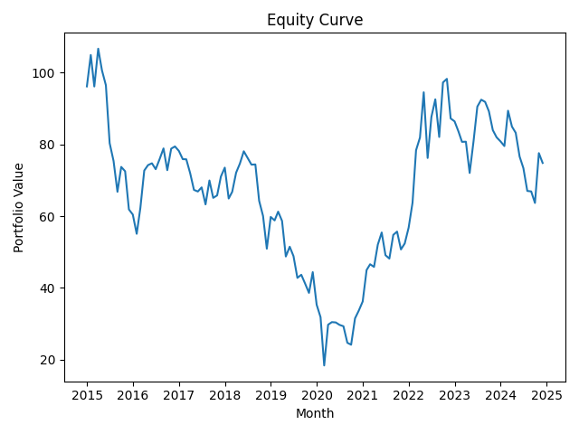

# Stock Screener 📈

A Python-based stock analysis and backtesting app using the **Financial Modeling Prep (FMP) API**.  
It collects large-cap ticker data, calculates monthly P/E ratios, and runs a simple sector-aware backtest to simulate investment performance over time.

## Features
- Pull large-cap tickers by sector from the FMP API
- Download monthly closing prices and quarterly EPS data
- Calculate monthly P/E ratios for each ticker
- Backtest a P/E-based trading strategy:
	- Buy if P/E < sector average
	- Track portfolio performance over time
- Calculate portfolio metrics:
	- CAGR
	- Sharpe
	- Max Drawdown

**Equity Curve**  
  
> *Proof‑of‑concept P/E‑spread strategy underperforms a simple buy‑and‑hold.  
> Next steps: integrate momentum filters, optimize rebalance frequency, and implement dynamic position sizing.*

## Project Structure

| File           | Use                                                 |
| -------------- | --------------------------------------------------- |
| `data_prep.py` | Download tickers, prices, EPS, calculate P/E ratios |
| `backtest.py`  | Run backtest, calculate performance metrics         |
| `config.py`    | API keys and base URL                               |

## Setup

1. Clone this repo:

    ```bash
    git clone https://github.com/lucasfox0/stock_screener.git
    cd stock_screener
    ```

2. Create and activate a virtual environment:

    ```bash
    python3 -m venv venv
    source venv/bin/activate
    ```

3. Install dependencies:

    ```bash
    pip install -r requirements.txt
    ```

4. Add your FMP API key in `config.py`

## How to Run

1. Prepare the data:
```bash
	python data_prep.py
```
Uncomment the function you want to run (get tickers, prices, EPS, P/E)

2. Run the backtest:
```bash
	python backtest.py
```
